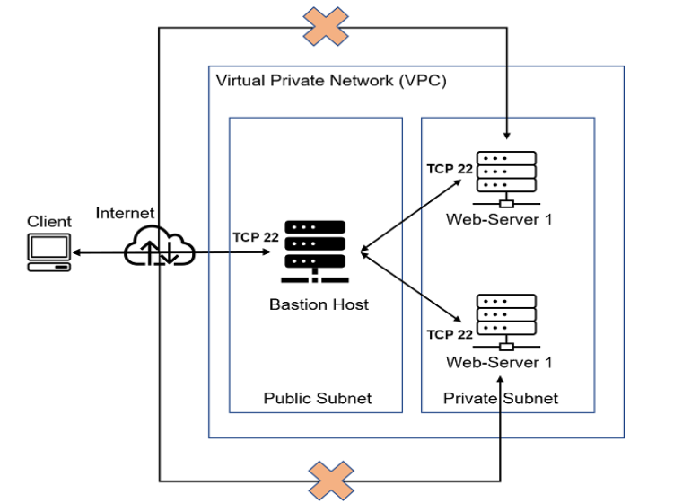
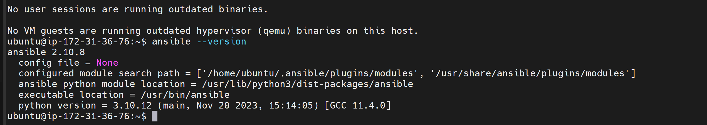
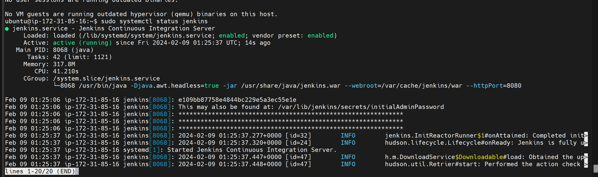
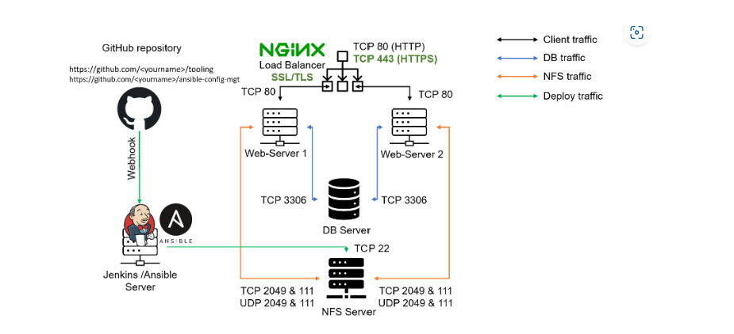

"# Ansible-config" 

Ansible-Automate Project
Ansible Configuration Management - Automate Project7 to 10
You have been implementing some interesting projects up until now, and that is awesome.
In Projects 7 to 10 you had to perform a lot of manual operations to set up virtual servers, install and configure requiredsoftware and deploy your web application.
This Project will make you appreciate DevOps tools even more by making most of the routine tasks automated with Ansible Configuration Management, at the same time you will become confi dent with writing code using declarative languages such as YAML.

Let us get started!

Instructions On How To Submit Your Work For Review And Feedback
To submit your work for review and feedback - follow
this instruction
.
Ansible Client as a Jump Server (Bastion Host)
A Jump Server (sometimes also referred as Bastion Host) is an intermediary server through which access to internal network can be provided. If you think about the current architecture you are working on, ideally, the webservers would beinside a secured network which cannot be reached directly from the Internet. That means, even DevOps engineers cannot SSH into the Web servers directly and can only access it through a Jump Server - it provides better security and reduces attack surface.

On the diagram below the Virtual Private Network (VPC) is divided into two subnets- Public subnet has public IPaddresses and Private subnet is only reachable by private IP addresses.




Tasks
Install and configure Ansible client to act as a Jump Server/Bastion Host
Create a simple Ansible playbook to automate servers configuration

1.  Update Name tag on your Jenkins EC2 Instance to Jenkins-Ansible. We will use this server to run playbooks.

2.  In your GitHub account create a new repository and name it ansible-config-mgt.
Install and configure ansible on ec2 instance

3. - Install and Configure Ansible on EC2 Instance
1.Update the Name tag on your Jenkins EC2 Instance to Jenkins-Ansible. We will use this server to run playbooks.

```markdown
sudo apt update
sudo apt install ansible
```

Check your Ansible version by running
```markdown
ansible --version
```



Install jenkins 

Step 1: Update the System Package Repository
Open a terminal and run the following command to ensure your package list is updated:

```sh
sudo apt update
```
Step 2: Install Java
Jenkins requires Java to be installed. You can install the default Java Development Kit with the following command:

```sh
sudo apt install default-jdk -y
```
Run Jenkins Debian Packages
This is the Debian package repository of Jenkins to automate installation and upgrade. To use this repository, first add the key to your system (for the Weekly Release Line):

```markdown
  sudo wget -O /usr/share/keyrings/jenkins-keyring.asc \
    https://pkg.jenkins.io/debian-stable/jenkins.io-2023.key
```
Then add a Jenkins apt repository entry:

```sh
 echo deb [signed-by=/usr/share/keyrings/jenkins-keyring.asc] \
    https://pkg.jenkins.io/debian-stable binary/ | sudo tee \
    /etc/apt/sources.list.d/jenkins.list > /dev/null
```

 ```sh
  sudo apt-get update
  sudo apt-get install fontconfig openjdk-17-jre
  sudo apt-get install jenkins
 ```
To check if Jenkins is installed and running, run the following command:
```sh
sudo systemctl status jenkins
```
If the Jenkins service is not running or active, run the following command to start it:
```sh
sudo systemctl enable --now jenkins
```



4.  Configure Jenkins build job to save your repository content every time you change it – this will solidify your Jenkins configuration skills acquired in Project 9.

Create a new Freestyle project ansible in Jenkins and point it to your ‘ansible-config-mgt’ repository.

Configure Webhook in GitHub and set webhook to trigger ansible build.

Configure a Post-build job to save all (**) files, like you did it in Project 9.

Test your setup by making some change in  file in master branch and make sure that builds starts automatically and Jenkins saves the files (build artifacts) in following folder

```markdown
ls /var/lib/jenkins/jobs/ansible/builds/<build_number>/archive/
```

Note: Trigger Jenkins project execution only for /main (master) branch.

Now your setup will look like this:



Step 2 – Prepare your development environment using Visual Studio Code
First part of ‘DevOps’ is ‘Dev’, which means you will require to write some codes and you shall have proper tools that will make your coding and debugging comfortable – you need an Integrated development environment (IDE) or Source-code Editor. There is a plethora of different IDEs and Source-code Editors for different languages with their own advantages and drawbacks, you can choose whichever you are comfortable with, but we recommend one free and universal editor that will fully satisfy your needs – Visual Studio Code (VSC), you can get it here.

After you have successfully installed VSC, configure it to connect to your newly created GitHub repository.

Clone down your ansible-config-mgt repo to your Jenkins-Ansible instance